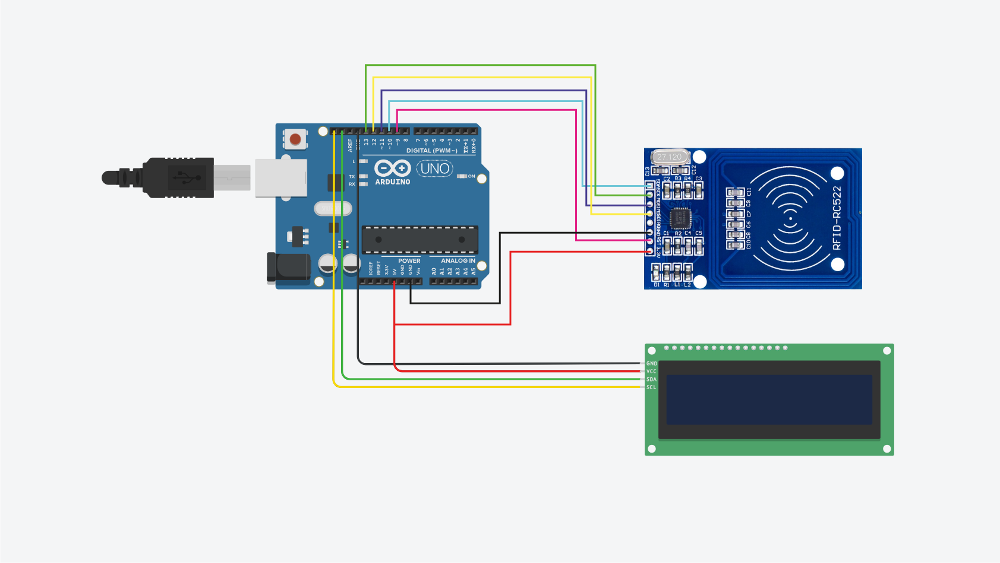
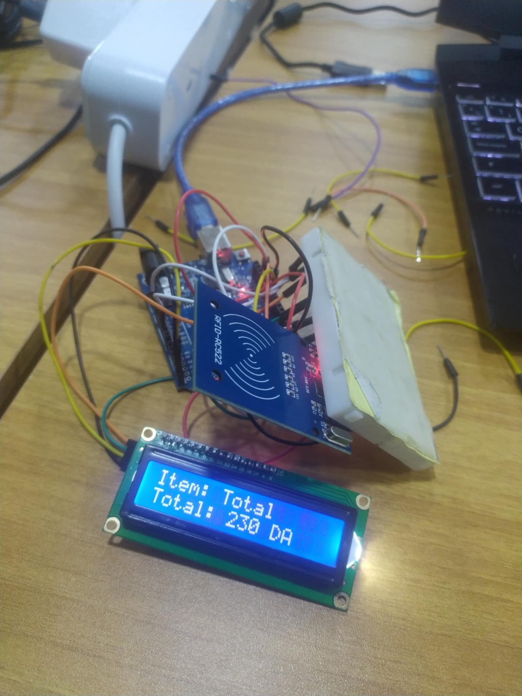
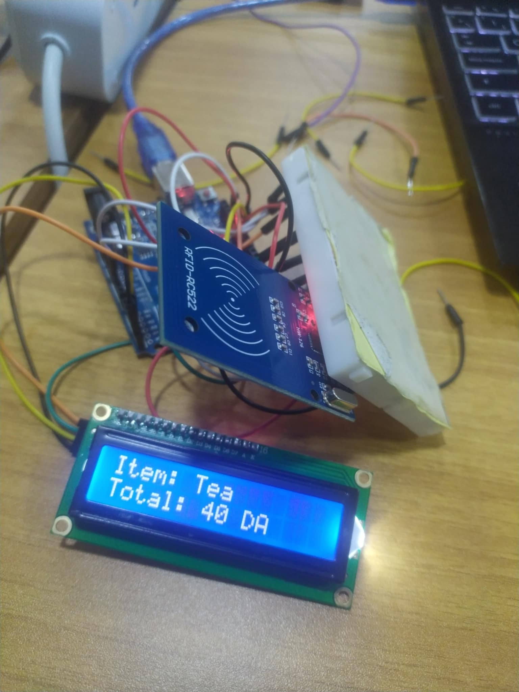
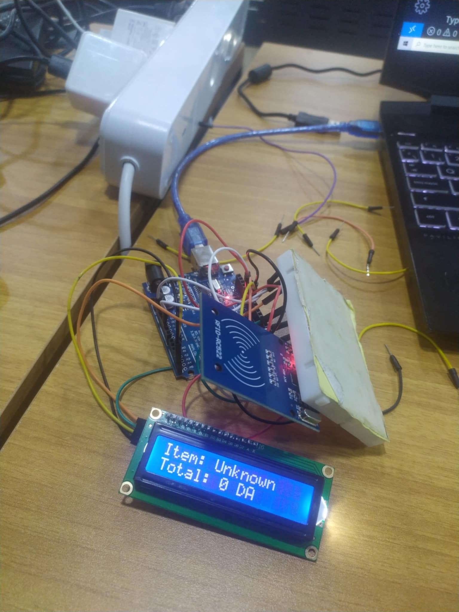
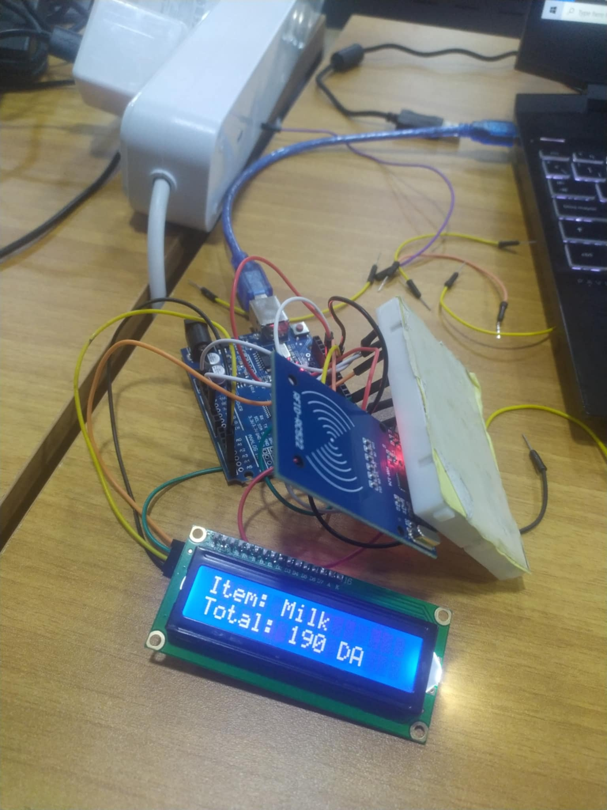
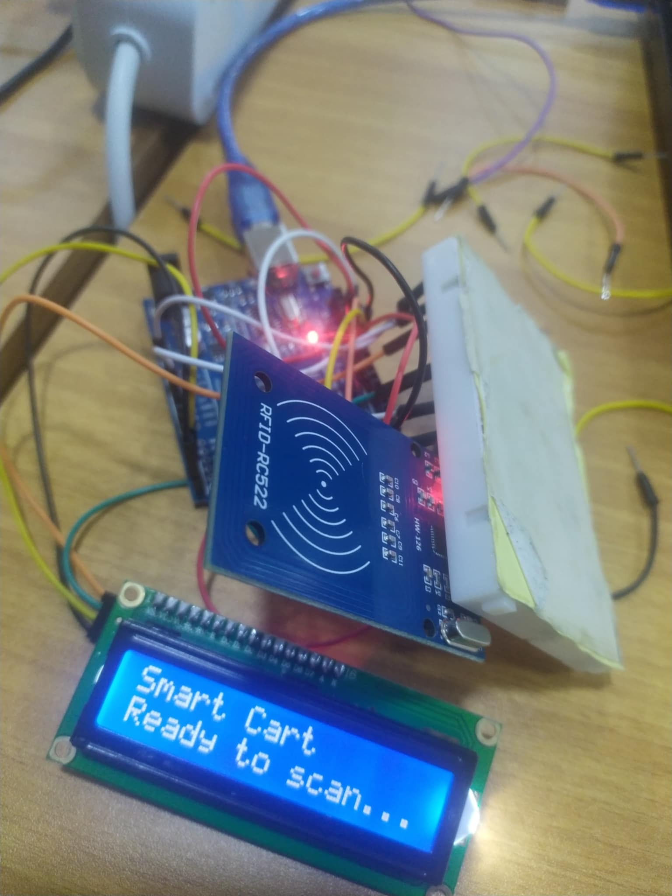
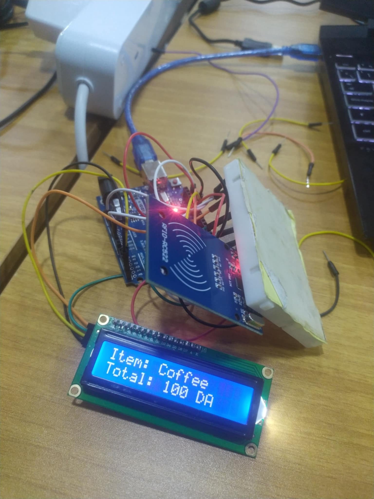

# Smart Cart RFID Checkout System

## 📌 Overview

This project implements an **RFID-based Smart Cart System** using **Arduino**, an **RFID reader (MFRC522)**, a **16x2 I2C LCD display**, and **Python** for processing scanned products. It allows scanning RFID-tagged products, displaying their names and prices on an LCD screen, and handling checkout via a Python terminal.

## 🛠 Components Required

- **Arduino Uno/Nano**
- **MFRC522 RFID Module**
- **16x2 I2C LCD Display**
- **Jumper Wires**
- **RFID Tags**
- **Python (for checkout processing)**

## 🔗 Wiring Diagram



## ⚙️ Setup

### **1️⃣ Arduino Setup**

1. Install **Arduino IDE**
2. Install necessary libraries:
   - `MFRC522` (for RFID communication)
   - `LiquidCrystal_I2C` (for LCD display)
3. Upload the provided **Arduino sketch** to your board.

### **2️⃣ Python Setup**

1. Install Python (3.x recommended)
2. Install required packages:
   ```bash
   pip install pyserial
   ```
3. Run the Python script to process scanned products.

## 🚀 Usage

1. Power up the Arduino.
2. Place an RFID-tagged product near the RFID reader.
3. The LCD will display the **product name and price**.
4. The Python script will process the scanned item and allow checkout.

## 📜 Code Structure

```
/SmartCartRFID
│── arduino_code.ino     # Arduino Sketch for RFID + LCD
│── checkout.py          # Python script for checkout processing
│── README.md            # Project Documentation
```

## 📸 Screenshot


## 🔧 Future Improvements







### **1️⃣ LED Indicators for Database Verification**

- Add **Green LED** to indicate when a scanned product exists in the database.
- Add **Red LED** to indicate when a scanned product is **not found** in the database.

### **2️⃣ Buzzer for Error Notifications**

- Integrate a **buzzer/speaker** to sound an alert if an **invalid product** is scanned.
- Different sound patterns for valid and invalid scans.

### **3️⃣ Expand Product Information Display**

- Modify the **LCD display** to show additional details like **category, expiry date**, etc.


